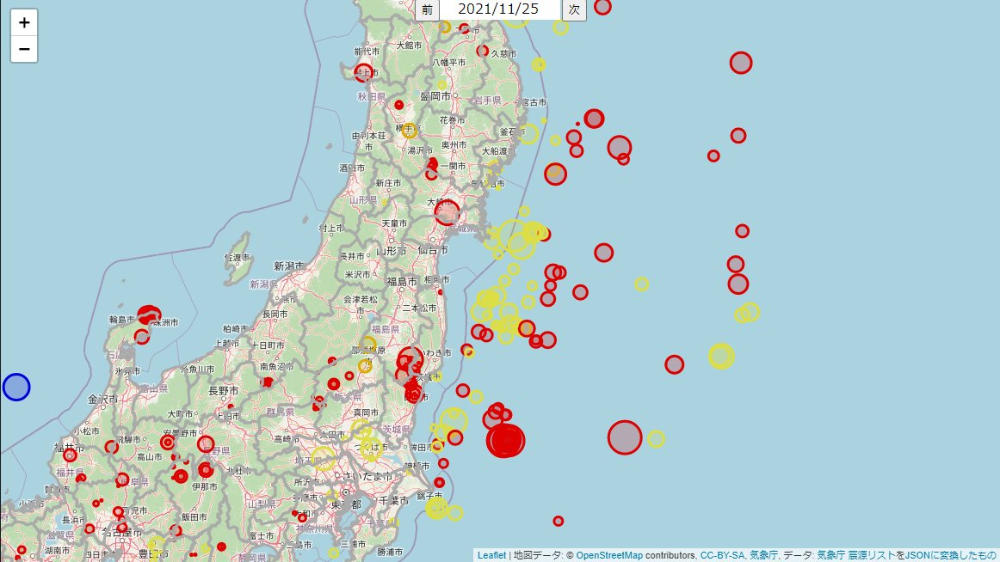
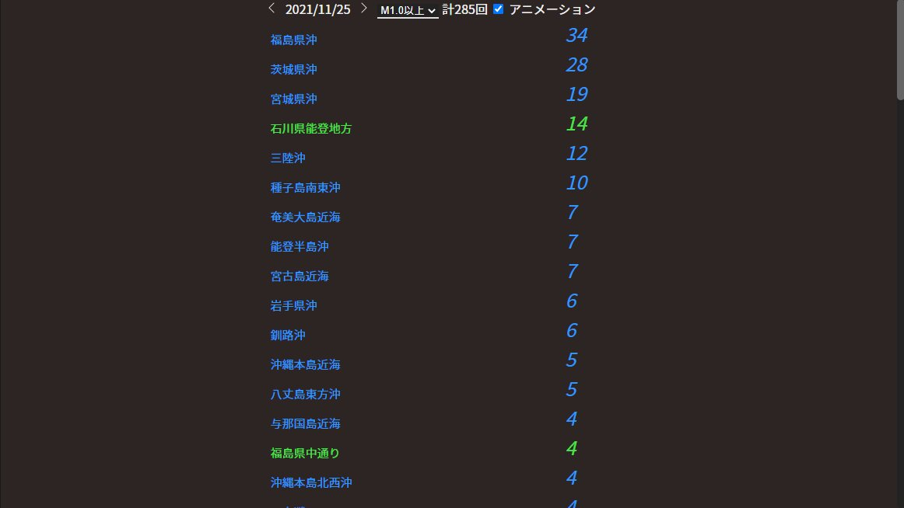

# hypolistjson
気象庁の震源リストをJSONに変換したものです(自動生成)  
`データ: 気象庁 震源リスト`のようにクレジットを書いて利用可能です。  
また、このリポジトリのリンクを書いてくれたら喜びます。  
クレジットやデータ使用については[気象庁ホームページのデータ利用の留意事項](https://www.data.jma.go.jp/developer/ryuui.pdf)をご確認ください。
## リンク
https://raw.githubusercontent.com/iku55/hypolistjson/main/data/[日付].json  
日付の例: 20210918
## 更新頻度
毎日午後8時(日本時間)に前日のデータを生成します。  
~~今日の日付の2日前の震源リストのページを約2時間ごとにチェックし、JSONに変換しています。~~  
~~(もしかしたら2時間ごとにするかも)~~
## 構造
```
[
  {
    "time": "2021-09-27T00:01:08.2+09:00", #時間(日本時間)
    "latitude": 37.151944444444446, #緯度(南緯)
    "longitude": 141.3838888888889, #経度(東経)
    "depth": "8", #深さ
    "magnitude": "1.3", #マグニチュード
    "name": "福島県沖" #震央地名
  },
  ...
]
```
## これを使用したもの
### [震源リストの地図(https://iku55.github.io/hypolistmap/)](https://iku55.github.io/hypolistmap/)

### [震源リストの回数(https://iku55.github.io/hypolistcount/)](https://iku55.github.io/hypolistcount/)

